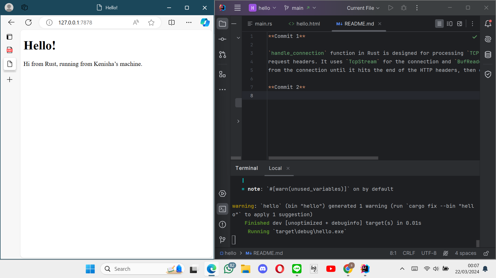
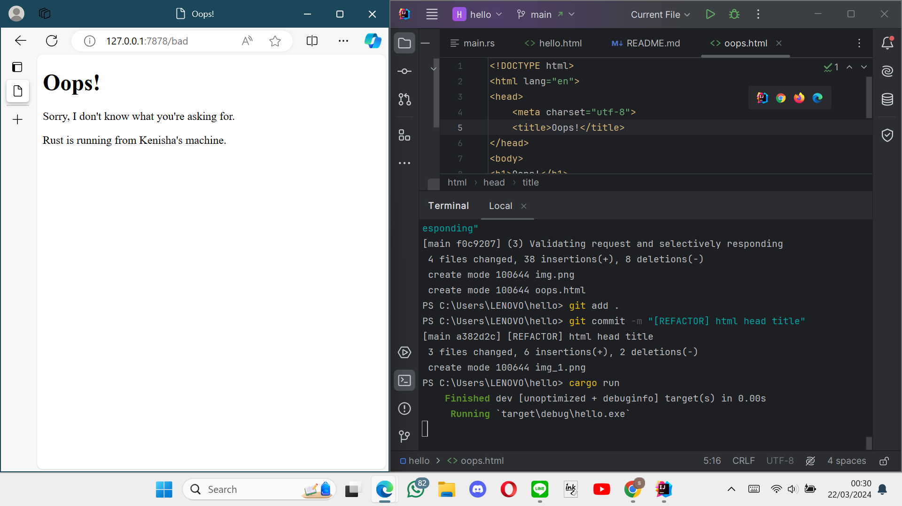

**Commit 1**

`handle_connection` function in Rust is designed for processing `TCP connections`, specifically to read and display HTTP 
request headers. It uses `TcpStream` for the connection and `BufReader` for efficient reading. The function reads lines 
from the connection until it hits the end of the HTTP headers, then collects and prints these headers. 

**Commit 2**

By changing the handle_connection function to show a simple HTML page, I learned a lot about how websites get to a browser. 
Before, the code just looked at the web request and didn't do much with it. 
But now, it actually sends back a real web page that we can see in our browser. 
This taught me how a server talks to a browser by following specific rules, like saying "OK" to tell the browser everything is fine and how big the page is so the browser knows what to expect. 
It also showed me how to use Rust to open a file and send its contents over the internet. 

**Commit 3**

- I've added a new HTML file named oops.html to act as the 404 Not Found page.
- Then, I modified the `handle_connection` function in our HTTP server.
- This function now examines the initial line of the client's HTTP request to check if it's a `GET/HTTP/1.1` request, indicating a request for the root path (/).
- If this is the case, it responds with the status line `HTTP/1.1 200 OK` and serves the content of the `hello.html` file.
- Otherwise, it issues a `HTTP/1.1 404 NOT FOUND` status line and serves the content of the `oops.html` file.
